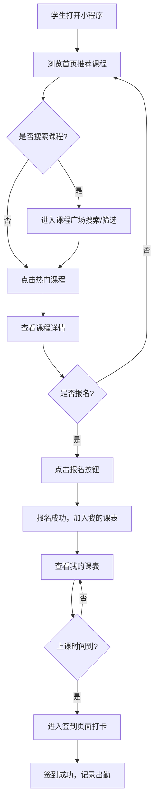

## 1. 产品概述

面向学生和家长的兴趣班选课管理小程序，帮助学生浏览、报名和管理兴趣课程，让家长实时掌握孩子的课程安排与学习进度。

- **目标用户**：学生（主要使用者）、家长（监督者）
- **核心价值**：一站式兴趣班选课、报名、课表查看与出勤管理

## 2. 核心功能

### 2.1 用户角色

| 角色 | 注册方式 | 核心权限 |
|------|----------|----------|
| 学生 | 姓名+手机号注册 | 浏览课程、报名/退课、查看课表、签到 |
| 管理员 | 预设账号 | 课程管理、学员管理、出勤统计 |

### 2.2 功能模块

1. **首页**：课程推荐、快捷入口、公告通知
2. **课程广场**：课程分类浏览、搜索筛选、课程详情
3. **我的课表**：周视图课表、课程提醒、上课签到
4. **个人中心**：学生信息、已报课程、学习记录

### 2.3 页面详情

| 页面名称 | 模块名称 | 功能描述 |
|----------|----------|----------|
| 首页 | 顶部导航 | 品牌Logo、消息通知入口 |
| 首页 | 搜索栏 | 快速搜索课程名称或老师 |
| 首页 | 轮播Banner | 热门课程推荐、活动通知轮播 |
| 首页 | 快捷入口 | 课程广场、我的课表、签到打卡、个人中心 |
| 首页 | 热门课程 | 展示热门兴趣班卡片，点击查看详情 |
| 课程广场 | 分类筛选 | 按类别（美术、音乐、体育、舞蹈、科技等）筛选 |
| 课程广场 | 课程列表 | 网格/列表展示课程卡片（封面、名称、老师、时间、价格） |
| 课程详情 | 课程信息 | 课程封面、详细介绍、任课老师、上课时间、剩余名额 |
| 课程详情 | 报名按钮 | 一键报名/取消报名，名额已满时置灰 |
| 我的课表 | 周视图日历 | 以周为单位展示每天的课程安排 |
| 我的课表 | 课程卡片 | 课程名称、时间、地点、签到状态 |
| 我的课表 | 签到打卡 | 课前签到按钮，记录签到时间 |
| 个人中心 | 个人信息 | 头像、姓名、年级、手机号 |
| 个人中心 | 我的课程 | 已报名课程列表，可查看和退课 |
| 个人中心 | 签到记录 | 历史签到记录与出勤率统计 |

## 3. 核心流程

## 4. 用户界面设计

### 4.1 设计风格

- **主色调**：暖橙色（#FF7B42）搭配柔紫（#7C5CFC），营造活力、温暖的氛围
- **辅助色**：浅绿（#4ECB71）用于成功状态，珊瑚红（#FF6B6B）用于重要提示
- **背景**：柔和渐变背景，卡片采用白色圆角毛玻璃效果
- **按钮**：大圆角（12px），带轻微阴影，点击有缩放反馈
- **字体**：标题用「得意黑」风格圆体，正文用系统默认字体
- **布局**：卡片式布局，移动端优先设计，底部导航栏
- **图标**：彩色圆角风格图标，活泼可爱

### 4.2 页面设计概览

| 页面名称 | 模块名称 | UI元素 |
|----------|----------|--------|
| 首页 | 顶部导航 | 居中Logo，右侧铃铛通知图标，底部柔和渐变背景 |
| 首页 | 搜索栏 | 圆角搜索框，搜索图标，点击展开搜索页 |
| 首页 | 轮播Banner | 圆角卡片，自动轮播，渐变遮罩文字 |
| 首页 | 快捷入口 | 4宫格图标，彩色背景圆角方块，文字标签 |
| 首页 | 热门课程 | 横向滚动卡片，课程封面图，标签（类别/年龄），价格 |
| 课程广场 | 分类筛选 | 顶部横向滚动分类标签，选中高亮色 |
| 课程广场 | 课程列表 | 两列网格布局，课程卡片带阴影悬浮效果 |
| 课程详情 | 课程信息 | 顶部大图封面，信息列表，底部固定报名栏 |
| 我的课表 | 周视图 | 横向滑动日历，今日高亮，课程彩色标签 |
| 个人中心 | 个人信息 | 圆角头像，信息卡片，统计数字展示 |

### 4.3 响应式设计

- 桌面端优先，适配平板和手机
- 移动端使用底部Tab导航，桌面端使用侧边栏导航
- 卡片在移动端单列、桌面端多列自适应

## 5. 非功能需求

- 页面加载速度 < 2秒
- 支持离线查看已缓存的课表信息
- 数据存储在本地（localStorage），无需后端服务