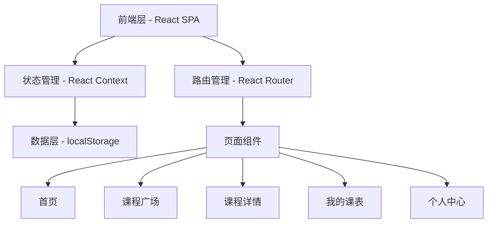
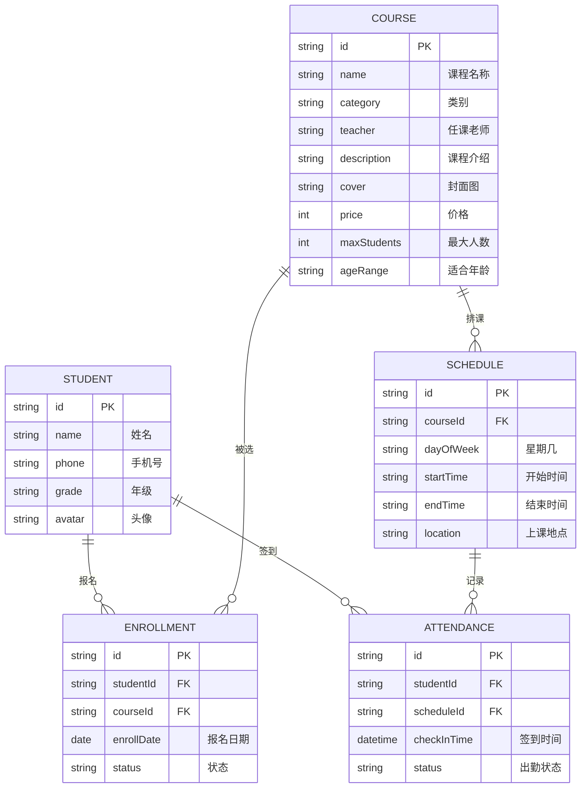

## 1. 架构设计



## 2. 技术选型

- **前端框架**：React@18 + TypeScript
- **样式方案**：TailwindCSS@3
- **构建工具**：Vite
- **路由**：React Router v6
- **状态管理**：React Context + useReducer
- **数据存储**：localStorage（模拟后端）
- **图标**：Lucide React
- **动画**：Framer Motion

## 3. 路由定义

| 路由 | 页面 | 说明 |
|------|------|------|
| / | 首页 | 课程推荐、快捷入口 |
| /courses | 课程广场 | 课程分类浏览与搜索 |
| /course/:id | 课程详情 | 单门课程详细信息 |
| /schedule | 我的课表 | 周视图课程安排 |
| /profile | 个人中心 | 学生信息与记录 |

## 4. 数据模型

### 4.1 实体关系



### 4.2 初始数据

系统预置模拟数据，包括：
- 10+ 门兴趣课程（美术、音乐、舞蹈、体育、科技等类别）
- 每门课程 2-3 个排课时间段
- 1 个学生示例账号
- 部分课程已有报名记录

## 5. 组件结构

```
src/
├── components/
│   ├── Layout.tsx          # 页面布局（桌面侧边栏/移动端底部Tab）
│   ├── CourseCard.tsx      # 课程卡片组件
│   ├── SearchBar.tsx       # 搜索栏组件
│   ├── CategoryFilter.tsx  # 分类筛选组件
│   ├── WeekCalendar.tsx    # 周视图日历组件
│   └── AttendanceBadge.tsx # 签到状态标签
├── pages/
│   ├── Home.tsx            # 首页
│   ├── Courses.tsx         # 课程广场
│   ├── CourseDetail.tsx    # 课程详情
│   ├── Schedule.tsx        # 我的课表
│   └── Profile.tsx         # 个人中心
├── context/
│   └── AppContext.tsx      # 全局状态管理
├── data/
│   └── mockData.ts         # 模拟数据
├── types/
│   └── index.ts            # 类型定义
├── App.tsx
└── main.tsx
```